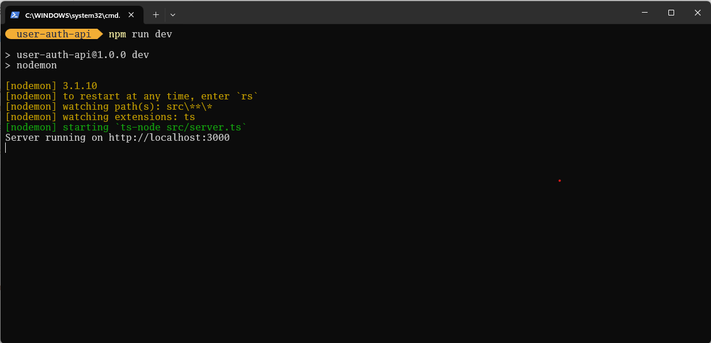
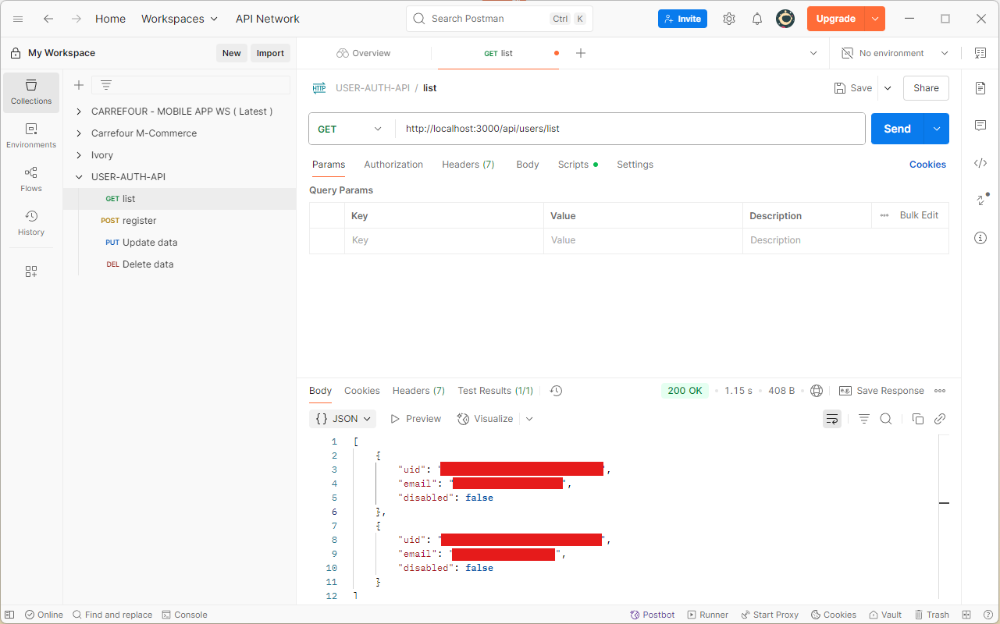

# API de Autenticação

## Desafio elaborado a fim de ilustração para desenvolvimento de uma API RESTful com funcionalidades de autenticação de usuários utilizando como principais tecnologias `Node.js`, `Express`, `TypeScript`, `Firebase` e `Jest`


### ✅ Pré-requisitos

- Deve ter previamente instalado em seu ambiente o [GIT](https://git-scm.com/downloads)

- Deve ter previamente instalado em seu ambiente o [Node.js](https://nodejs.org)
  > Utilizei para este projeto a versão `v20.10.0`

 

---

### 🚀 Instalação do projeto

1. Clone o repositório:

```bash
git clone https://github.com/evertoncruz/user-auth-api.git
```

2. Acesse a pasta do projeto:

```bash
cd user-auth-api
```

3. Instale as dependências:

```bash
npm install
```

---

### 🔐 Configuração do Firebase

1. Crie um projeto no [Firebase Console](https://console.firebase.google.com)
2. Vá em `Configurações do Projeto` > `Contas de Serviço` e clique em **"Gerar nova chave privada"**
3. Salve o arquivo `firebase-service-account.json` na raiz do projeto (adicione ao `.gitignore`)
4. Crie um arquivo `.env` na raiz com sua chave de API e demais variáveis (adicione ao `.gitignore`):

```env
PORT=3001
FIREBASE_TYPE=type
FIREBASE_PROJECT_ID=project_id
FIREBASE_PRIVATE_KEY_ID=private_key_id
FIREBASE_PRIVATE_KEY=private_key
FIREBASE_CLIENT_EMAIL=client_email
FIREBASE_CLIENT_ID=client_id
FIREBASE_AUTH_URI=auth_uri
FIREBASE_TOKEN_URI=token_uri
FIREBASE_AUTH_PROVIDER_X509_CERT_URL=auth_provider_x509_cert_url
FIREBASE_CLIENT_X509_CERT_URL=client_x509_cert_url
FIREBASE_UNIVERSE_DOMAIN=universe_domain
```

---

### 📦 Scripts disponíveis

| Comando | Ação |
|--------|------|
| `npm run dev` | Inicia o servidor em modo de desenvolvimento (nodemon + ts-node) |
| `npm run build` | Compila o TypeScript para JS |
| `npm run start` | Executa a versão compilada |
| `npm run test` | Executa os testes unitários com Jest |

---

### 📮 Rotas disponíveis

- `POST /api/users/register` – Criação de usuário com e-mail e senha
<!-- - `GET /api/users/list` – Listagem de usuários (Firebase Auth) TODO -->
- [em desenvolvimento] `POST /api/users/login` – Autenticação via REST (Firebase Identity Toolkit)

---

### ✅ Executar o servidor

Após instalar dependências e configurar variáveis:

```bash
npm run dev
```

O servidor será iniciado em:

```
http://localhost:3001
```

---

### 🧪 Executar os testes

```bash
npm run test
```

Os testes utilizam `Jest` e `Supertest` para validar o comportamento das rotas e dos serviços.

---

### 🧠 Observações

- A autenticação está sendo feita com Firebase Admin SDK
- A criação de usuários utiliza o `admin.auth().createUser()`
- O login pode ser feito via Firebase REST API com `signInWithPassword`
- A listagem de usuários utiliza `admin.auth().listUsers()`
- Os tokens de login (JWT) devem ser validados com `admin.auth().verifyIdToken()`

---

### 📁 Licença

MIT

---

👤 Autor: Everton Cruz